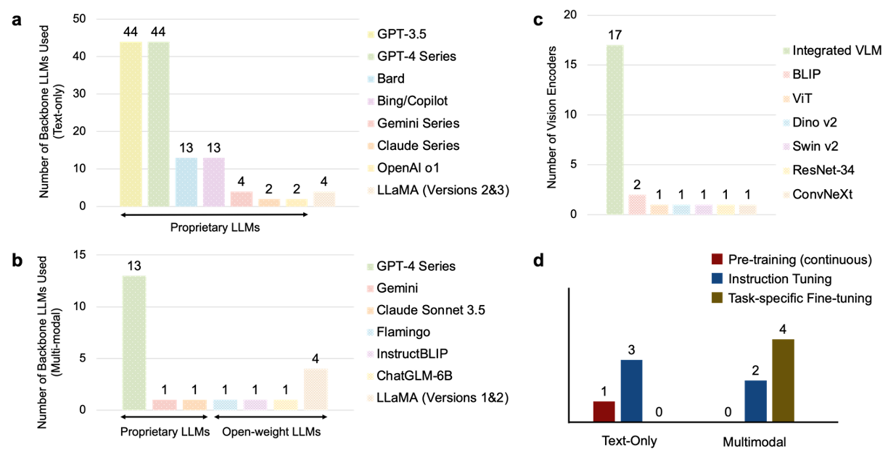
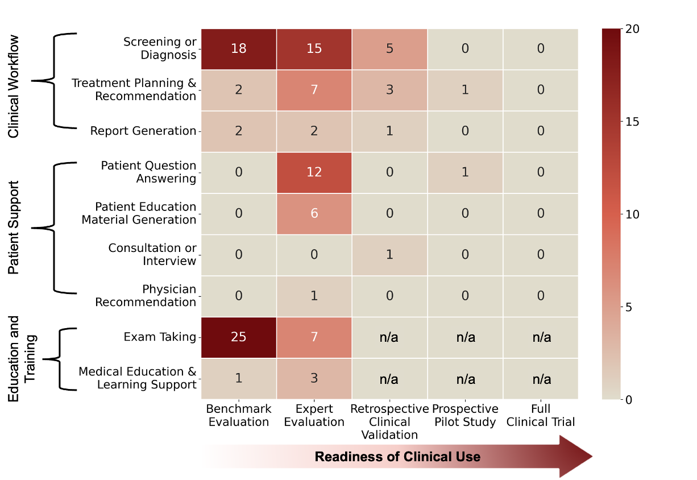
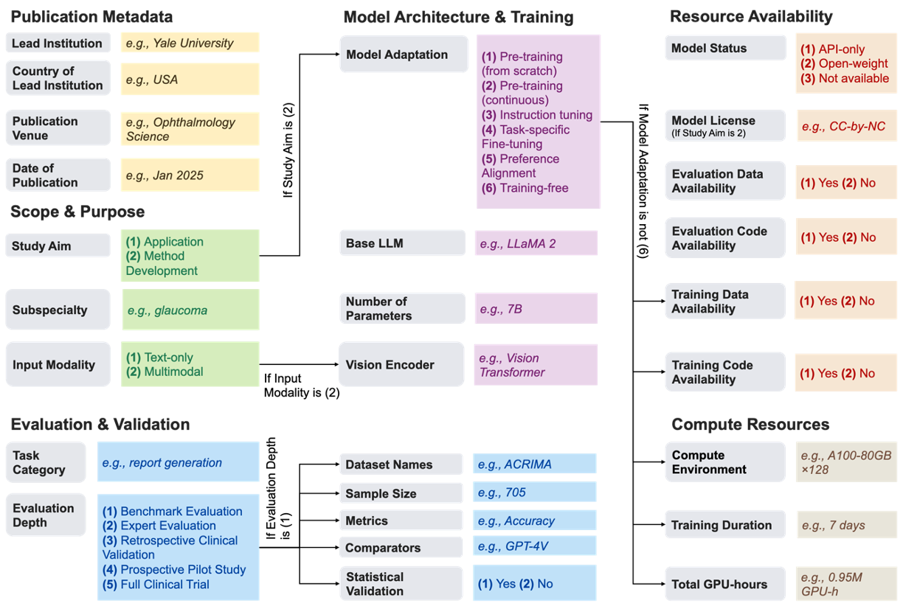
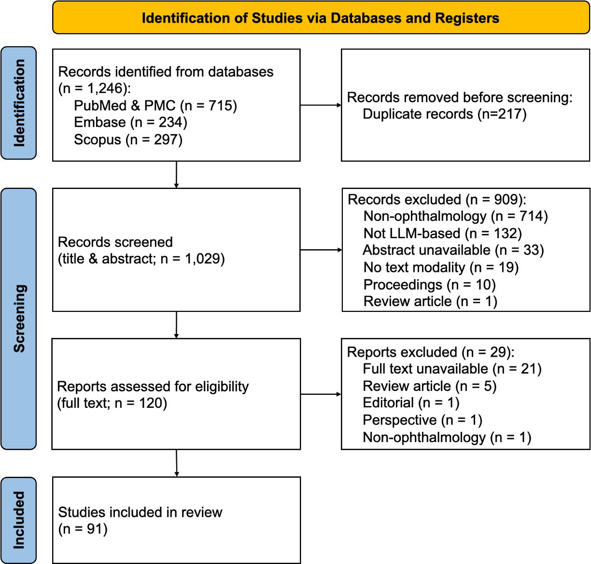

# A *Living* Review of Large Language Models and Multimodal AI in Ophthalmology


## 📖 About This Project

This repository serves as the official repository for our systematic review: **"[How Far Have Large Language Models Advanced in Ophthalmology? A Systematic Review of Their Development, Evaluation, and Readiness for Clinical Use.](https://doi.org/10.21203/rs.3.rs-8819770/v1)"**

Our systematic review synthesizes literature from **January 1, 2022, to April 1, 2025** using rigorous inclusion criteria from biomedical databases (PubMed/PMC, Scopus, Embase). However, the field of AI is moving faster than traditional publishing cycles. Also, the biomedical databases may not comprehensively capture relevant work from the AI or computer science literature, including preprints hosted on platforms such as arXiv. 

**This repository aims to bridge that gap by:**
1.  **Continuously Updating:** Tracking new studies published after April 2025.
2.  **Expanding Scope:** Curating relevant AI/CS conference papers (e.g., CVPR, NeurIPS) and preprints (arXiv) that fall outside standard biomedical indices but are critical to the field.
3.  **Open Data:** Providing the granular data extraction (27 variables) for all studies included in the review with fine-grained analysis. 
---

## Key Findings

Here, we briefly summarize key findings from our systematic review; more detailed quantitative results will be provided in the forthcoming preprint.

### 1) Publication landscape
- Total included studies: **N = 91**  
- Research grew rapidly through 2023–2024, with a modest drop in H1 2025.  
- Most studies are published in ophthalmology / medical informatics venues; relatively few in broader AI venues.

<p align="center">
  <b>Figure</b>: Publication trend stratified by modality & study aim<br>
  
</p>

---

### 2) Study aim & modality
- **Evaluation/Application dominates** (vs methodological contributions).  
- **Text-only** studies remain the majority; **multimodal** work increased later.

---

### 3) Model landscape & adaptation
- Backbone usage is dominated by widely accessible **proprietary LLMs** (e.g., GPT-3.5 / GPT-4 series).  
- Open-weight backbones (e.g., LLaMA families) appear less frequently in text-only studies; multimodal has relatively higher open-source presence.
- The majority of studies **do not involve additional training**; only a minority report instruction tuning / task-specific fine-tuning / pretraining.

<p align="center">
  <b>Figure</b>: Backbone LLM distribution (text-only vs multimodal) & Adaptation strategies (no training vs instruction tuning vs finetuning vs pretraining)<br>
  
</p>

---

### 4) Clinical task taxonomy (9 subcategories)
We organize use cases into **3 major categories → 9 fine-grained subcategories**:

**A. Clinical workflow**
- Screening or diagnosis  
- Treatment planning & recommendation  
- Report generation

**B. Patient support**
- Patient question answering  
- Patient education material generation  
- Consultation or interview  
- Physician recommendation

**C. Education & training**
- Exam taking  
- Medical education & learning support

<p align="center">
  <b>Figure</b>: Task taxonomy overview<br>
  
</p>

---

### 5) Evaluation depth & clinical readiness (5-level framework)
We stratify evaluation rigor into five levels:
1. Benchmark evaluation  
2. Expert evaluation  
3. Retrospective clinical validation  
4. Prospective pilot study  
5. Full clinical trial

Key observations:
- Benchmark and expert evaluations are common.
- Retrospective validation and prospective pilots are rare.
- **No full clinical trials** in the included literature.

---

## Methods
### Search strategy
- Time window: 2022-01-01 to 2025-04-01  
- Databases: PubMed/PMC, Scopus, Embase  
- Query: 
```text
[
  (
    "large language model*" OR LLM OR "language model*" OR "foundation* model*" OR GPT OR ChatGPT OR LLaMA OR PaLM OR Gemini OR Mistral OR Falcon OR Claude OR bloom OR qwen OR deepseek OR o1
  )
  AND
  (
    "Ophthalmology"[Mesh] OR ophthalmology OR eye OR "eye disease*"
  )
  AND
  (
    pretrain* OR pre-train* OR finetun* OR fine-tun* OR "instruction tun*" OR train*
  )
  AND
  (2022/01/01:2025/04/01[dp])
  NOT review[pt]
  NOT systematic[sb]
  NOT clinical trial[pt]
  NOT case reports[pt]
  NOT meta-analysis[pt]
]
```

### Study selection
Studies were included if they met all of the following criteria:
(1) Primary research articles that were publicly available (published or preprint) within the search window (January 1, 2022 – April 1, 2025). 
(2) The study primarily developed, evaluated, or utilized LLMs for ophthalmology-related applications.
LLMs had to be a central component of the study, either as the main target of evaluation or as a core methodological element, rather than being used solely as a baseline or comparison.
(3) Multimodal models were considered eligible when an LLM-based architecture was used as the primary component.

Studies were excluded if they met any of the following:
(1) Non–primary research articles, including reviews, meta-analyses, editorials, perspectives, correspondence, and study protocols.
(2) Studies not published in English.
(3) Conference abstracts without a corresponding full-text publication.
(4) Multimodal models that did not incorporate LLM architectures as their primary backbone, and vision-only models.

### Data extraction schema (27 variables)
We extracted **27 variables across six domains**:
1) Publication metadata  
2) Scope & purpose  
3) Model architecture & training  
4) Evaluation & validation  
5) Resource availability  
6) Computational resources

<p align="center">
  <b>Figure</b>: 27 variables in data extraction<br>
  
</p>

### Results & study inclusion

<p align="center">
  <b>Figure</b>: PRISMA flow diagram<br>
  
</p>

---

## Included Studies (Systematic Review Set)
- `studies/systematic_review/` *(TBD)*
- Master list (CSV/JSON): `data/studies_systematic_review.csv` *(TBD)*

---
## 📚 Ophthalmology QA Resources & Benchmarks

We catalog the datasets and resources used across the systematic review to facilitate future benchmarking.

### 📝 Text-Based: Exams, QA & Medical Education
*Primarily evaluating clinical knowledge, reasoning, and patient communication.*

[TBD]

---

### 🖼️ Multimodal: Imaging, Screening & Diagnosis
*Evaluating visual interpretation capabilities on fundus, OCT, and slit-lamp imagery.*

[TBD]

---

## Discussion Summary
> Keep this short; link to the paper for full discussion.

- What the field is doing well: [TBD]  
- Where evidence is weak (evaluation depth gap): [TBD]  
- Main barriers to clinical translation: [TBD]  
- Reporting gaps / reproducibility issues: [TBD]

---

## Living Complement (Beyond the Systematic Review Set)

### Scope for additions
- Must be within the paper's scope (ophthalmology + LLM/MLLM central component)  
- Can include arXiv / CS conferences / industry reports if relevant  
- Must include minimal metadata: venue/date, task, modality, evaluation type

### How additions are labeled
- `source = living-complement` (vs `source = systematic-review`)  
- Tagging: `#task`, `#modality`, `#evaluation-depth`, `#data-availability`, `#open-weight`

### Where these entries live
- `studies/living_complement/` *(TBD)*  
- Master list: `data/studies_living_complement.csv` *(TBD)*

---

## 📬 Contact

For questions or suggestions, feel free to open an issue or email us (`hyunjae.kim@yale.edu` or `qingyu.chen@yale.edu`).
